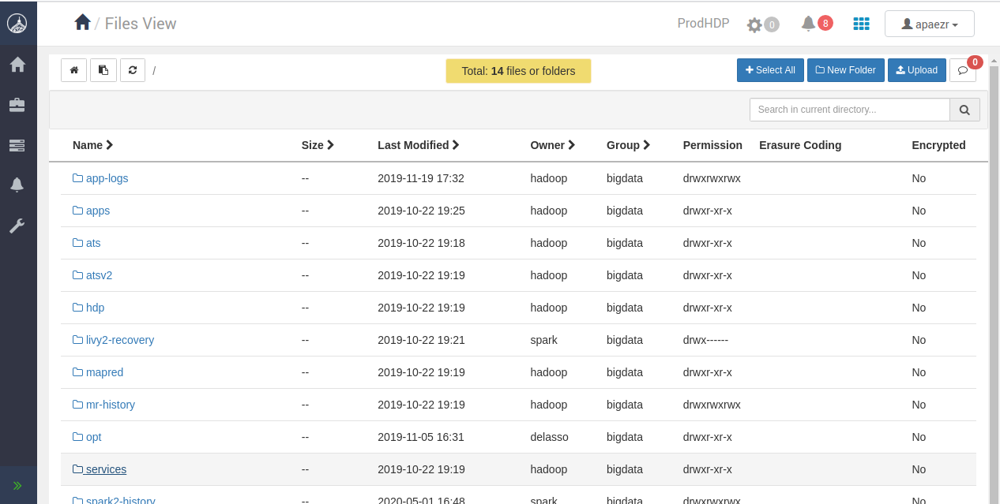
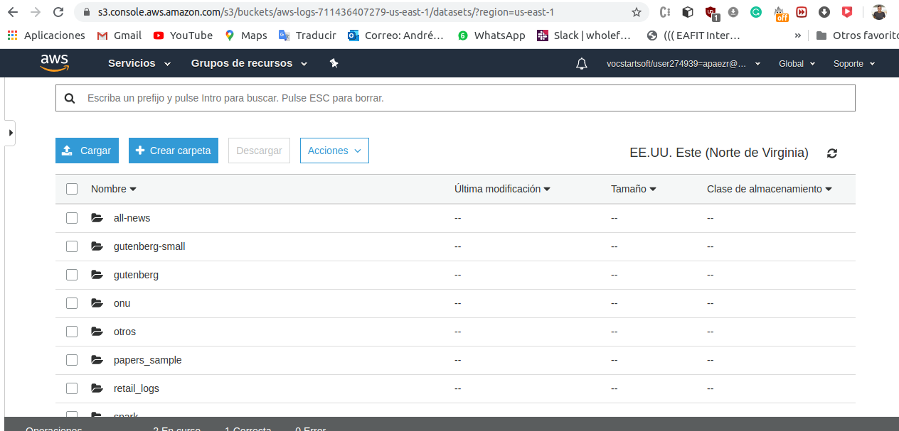
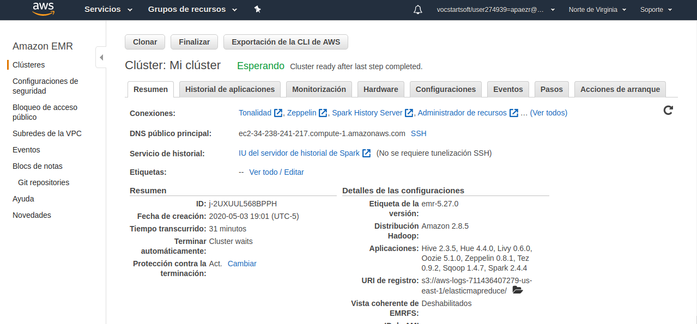
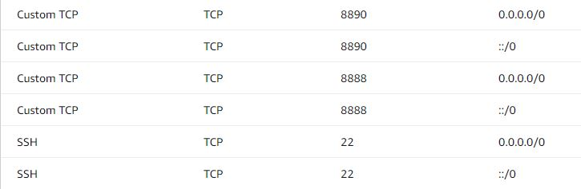
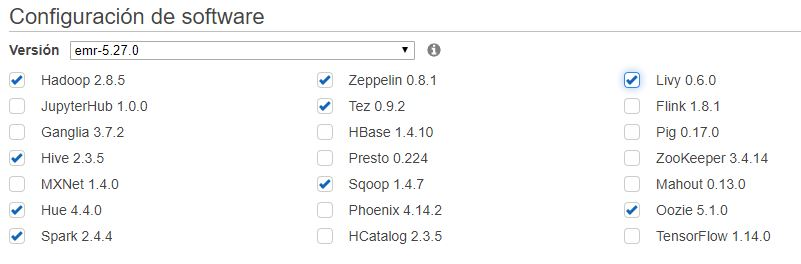

# First lab bigdata module

## DCA 
  * Log into VPN
  * Log into dca instance:
    * ssh apaez@192.168.10.116
  * Download the bigdata repository:
    * git clone https://github.com/st0263eafit/bigdata.git 
  * Create a new directory in hdfs and copy the datasetes:
    * hdfs dfs -mkdir /user/apaezr/datasets
    * hdfs dfs –copyFromLocal datasets/* /user/apaezr/datasets/
    
### Ambari

### S3 

### ERM

