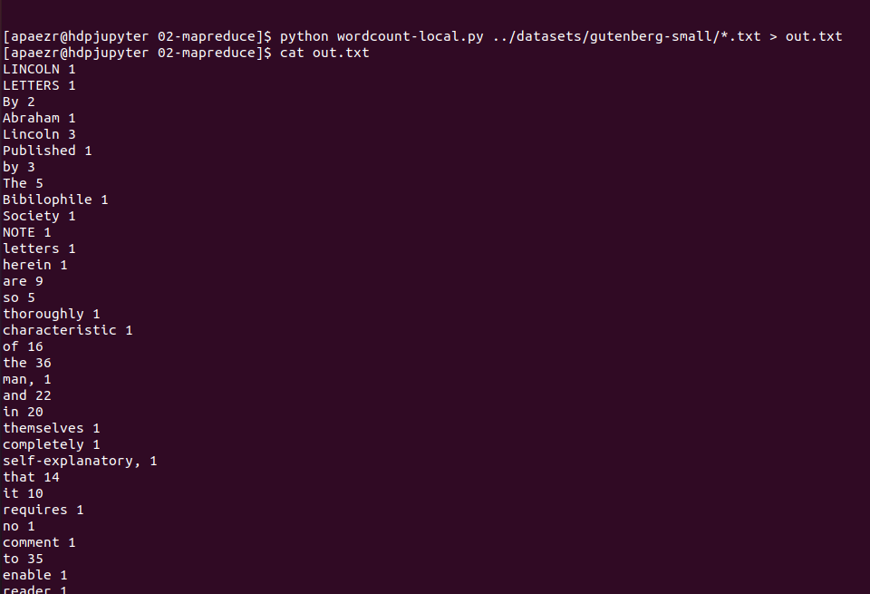
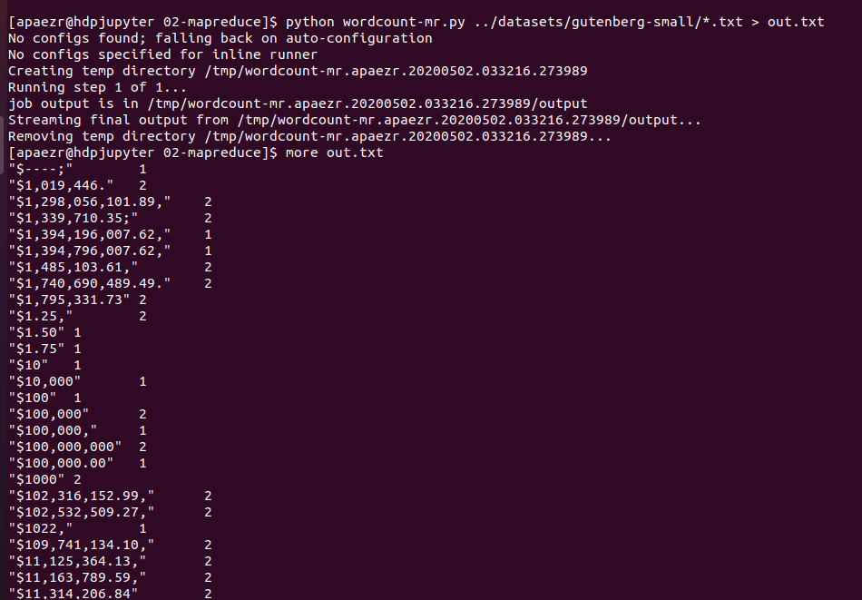
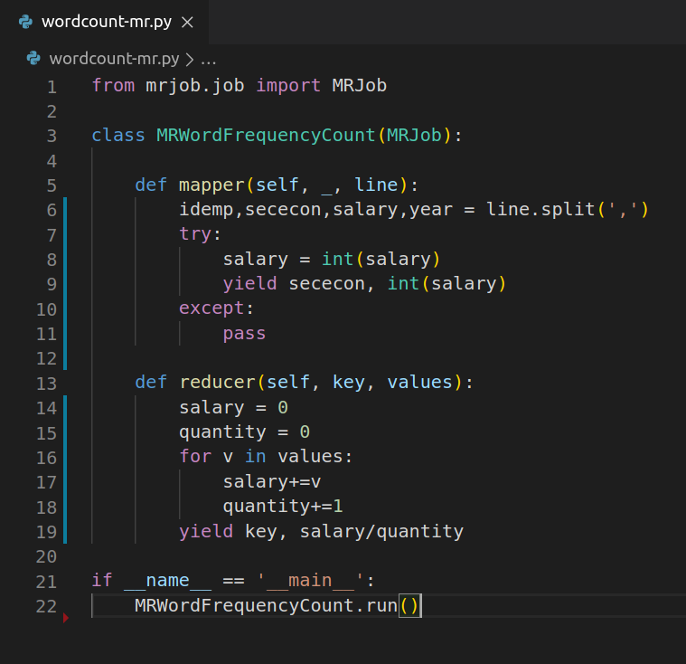
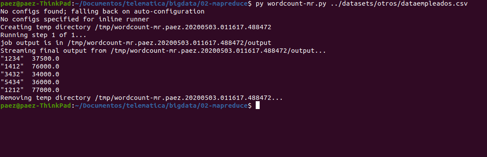
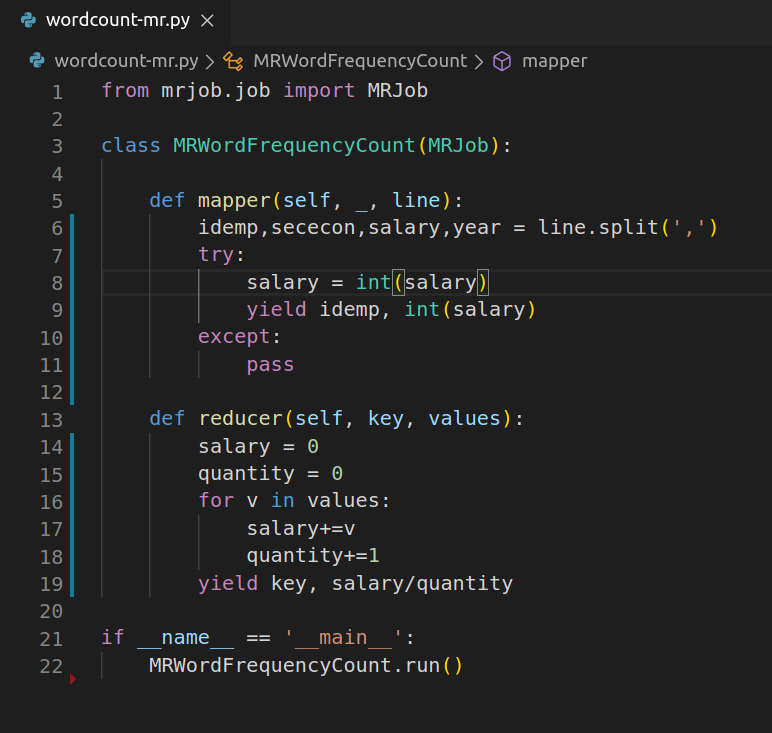
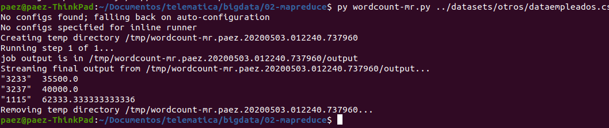
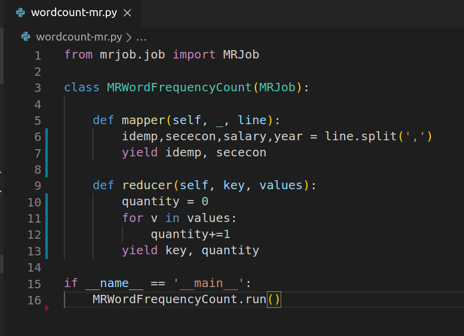
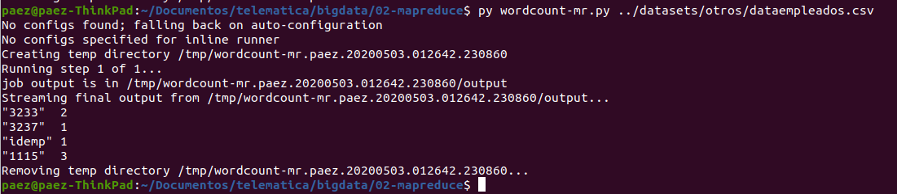

# Mapreduce laboratory

* Performing local tests
  * python wordcount-local.py ../datasets/gutenberg-small/*.txt > out.txt

* Performing mariojb test
  * python wordcount-local.py ../datasets/gutenberg-small/*.txt > out.txt

## Ex #2

### The salary average by SE

### The salary average by employee

### SE times by employee

